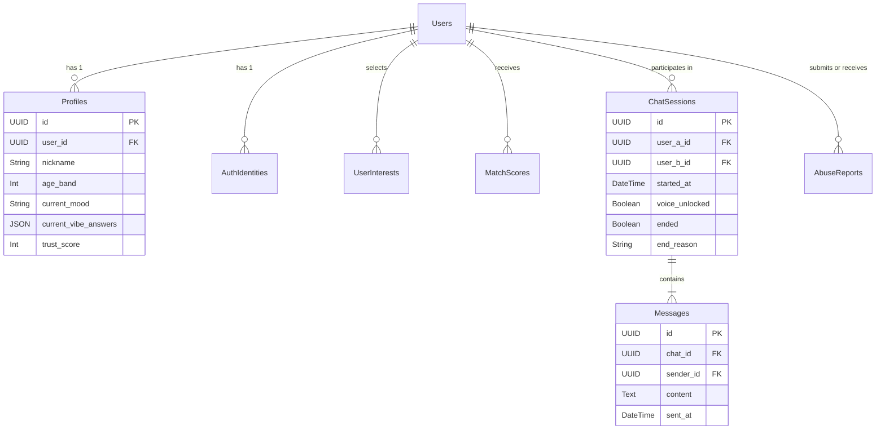

# Database ERD (Entity Relationship Diagram)
The DB is designed in PostgreSQL using robust foreign key relationships focusing on the separation of Authentication vs Public Profile vs Match State.

## Diagram Structure
*(Designed referencing a traditional Mermaid.js format)*

## Key Entities
- **AuthIdentities**: Securely stores hashed email/passwords or OAuth tokens. This separates PII entirely from the matching engine.
- **Profiles**: Contains public-facing (within the app) metrics like Nickname, Mood, and Trust Score. This dictates algorithm matching logic without exposing raw users.
- **MatchScores**: Stores the output of the Matching Engine (`user_a`, `user_b`, `compatibility_score`).
- **AbuseReports**: Records `reporter_id`, `reported_id`, `chat_session_id`, and `reason` for admin review. Strongly coupled to Chat Sessions to enable Admins to pull chat history securely when specifically authorized by the report function.
